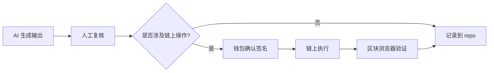

# Week 1 模块 C｜最小交叉实验：AI 输出到链上执行

## 目标

把 AI 与 Web3 放到同一条任务链上。重点不是做复杂项目，而是第一次看见：
**AI 输出 → 人工复核 → 钱包确认 → 链上执行 → 区块浏览器验证** 之间如何衔接。

## 选择一条实验路线

- [ ] **路线 1**：AI 生成合约交互说明或脚本 → 人工复核 → 测试网执行
- [ ] **路线 2**：AI 解释一笔交易或合约 ABI → 人工检查 → 整理为学习记录
- [ ] **路线 3**：AI 生成任务计划 → 涉及签名 / 转账时暂停 → 人工确认后继续

## 流程图（必填）

画出完整流程，可用文字描述或 Mermaid 图：

**补充说明（标出日志节点、失败点、人工确认节点）：**
<!-- 在哪里记录日志？哪些步骤可能失败？哪些步骤必须人工确认？ -->

## 实验记录

**选择的路线：**

**AI 做了什么（输入是什么）：**
<!-- 把什么任务交给了 AI，用了什么 prompt -->

**AI 输出（摘要）：**
<!-- AI 生成了什么内容，是否可靠 -->

**人工复核过程：**
<!-- 你检查了什么，修改了什么，发现了什么问题 -->

**链上操作记录（如有）：**

| 项目 | 值 |
|------|----|
| 操作类型 | |
| 交易哈希 | |
| 合约地址 | |
| 区块浏览器链接 | |

**验证材料：**
<!-- 截图 / 链接 / commit 记录 -->

## 概念说明（必填）

用自己的话，把以下概念放到同一条任务链里解释：

**LLM 在这条链里的角色：**
<!-- -->

**Workflow 是什么，和直接 prompt 有什么不同：**
<!-- -->

**Agent 是什么，和 workflow 有什么不同：**
<!-- -->

**钱包在这条链里的角色：**
<!-- -->

**签名的含义（不是普通登录，而是...）：**
<!-- -->

**交易 = 什么 + 什么：**
<!-- -->

**合约执行和普通后端调用有什么不同：**
<!-- -->

## 安全与人工确认记录

| 操作 | 是否需要人工确认 | 原因 |
|------|-----------------|------|
| AI 生成代码 | 是 | 可能有错误或越权操作 |
| AI 生成 prompt / 计划 | 是（部分） | 可能包含不准确信息 |
| 钱包签名 | 是（必须） | 签名 = 授权具体动作 |
| 合约写入操作 | 是（必须） | 不可撤销 |
| 测试网交易 | 是 | 养成习惯 |

**本次实验中，你在哪些节点做了人工确认？**
<!-- -->

## 高级挑战（可选）

- [ ] 把"AI 生成 → 人工复核 → 钱包确认 → 链上执行"拆成可描述的 workflow，标出日志 / 失败点 / 回滚策略 / 人工确认节点
- [ ] 比较同一任务在"纯人工" / "AI 辅助" / "更自动化流程"三种方式下的差异与风险
- [ ] 做一个受限的 Web3 助手（文档问答 / 交易解释），必须说明它不能自动执行哪些高风险动作

## 状态

- [ ] 选定实验路线
- [ ] 流程图完成
- [ ] 实验执行完成
- [ ] 概念说明完成
- [ ] 验证材料已记录
